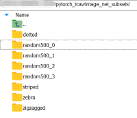
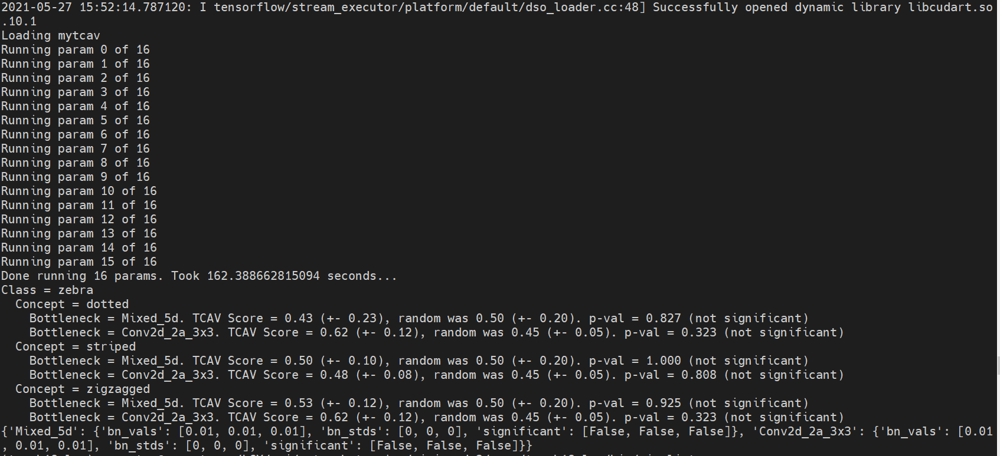
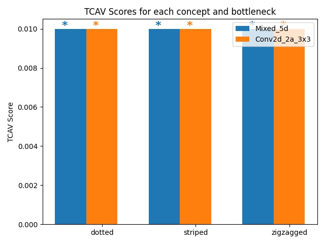

# TCAV
Quantitative Testing with Concept Activation Vectors in PyTorch

Interpretability Beyond Feature Attribution: Quantitative Testing with Concept Activation Vectors (TCAV) [ICML 2018]

## Environment
- Ubuntu 16.04
- NVIDIA GeForce 1080
- CUDA 10.1
- tensorflow==2.3.0, torch==1.8.1
- matplotlib==2.2.4, Pillow==8.1.1, scikit-learn==0.20.3, scipy==1.2.1, numpy==1.19.2, protobuf==3.10.0, pandas==1.0.3

## Download and preprocess data
```
cd imagenet
# Download broden dataset
curl -O http://netdissect.csail.mit.edu/data/broden1_224.zip
mkdir "broden1_224"
unzip broden1_224.zip -d broden1_224
rm broden1_224.zip
```
```
python download_and_make_datasets.py
# three parameters: source_dir, number_of_images_per_folder, number_of_random_folders
# Look https://github.com/tensorflow/tcav/blob/master/Run_TCAV.ipynb
```
Copy these dirs (Concept dirs, label dir, random dirs) to Dir 'image_net_subsets'.



## Run
```
python run.py
```
The terminal will output:



and save the result img:



## References
- [TensorFlow tcav](https://github.com/tensorflow/tcav)
- [rakhimovv PyTorch](https://github.com/rakhimovv/tcav)